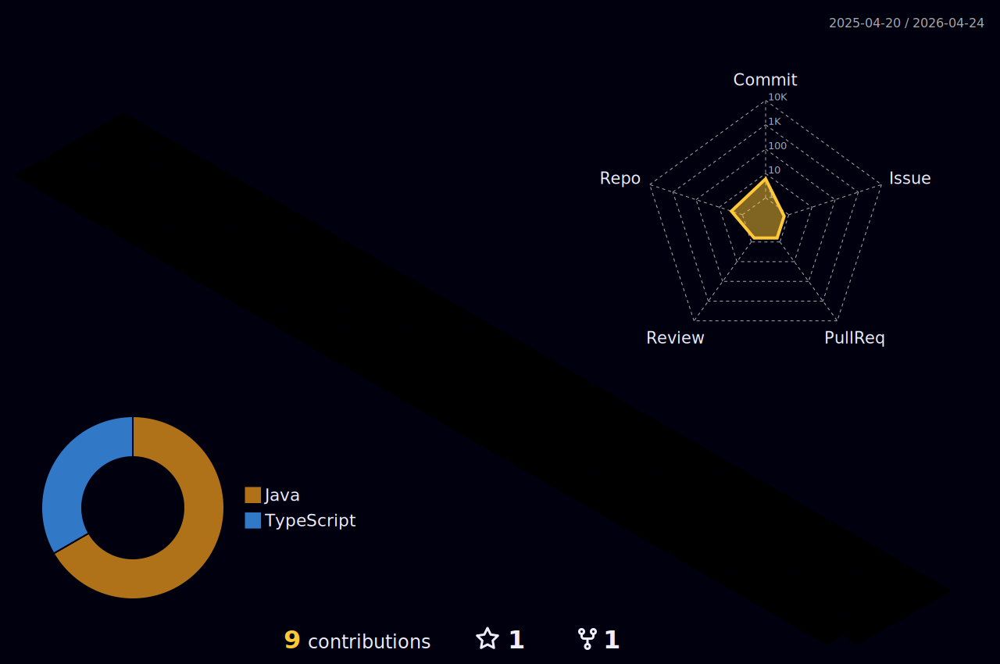

<h1 align="center"> 👋 Hi, I'm Gustavo Maisatto</h1>

 
Sou um Desenvolvedor full-stack, atualmente trabalho construindo soluções internas na Media.monks como technology analyst.

Sou apaixonado por tecnologia, e desenvolvimento web, gosto de participar de todo o ciclo de criação, desde a prototipação da solução até a construção de apis, backend e frontend.

Também gosto de trabalhar com dados que é uma das vertentes do meu trabalho.

- :zap: Main language: 
  ######
- :bulb: Frontend:        
  ######
- 📡 Backend:   
  ######
- ☁️ Cloud: 
  ######
- 📖: Interesses:    
  ######

  

  
  
   

  

 
  
  
  
 

<!--
**gustavomaisatto/gustavomaisatto** is a ✨ _special_ ✨ repository because its `README.md` (this file) appears on your GitHub profile.

Here are some ideas to get you started:

- 🔭 I’m currently working on ...
- 🌱 I’m currently learning ...
- 👯 I’m looking to collaborate on ...
- 🤔 I’m looking for help with ...
- 💬 Ask me about ...
- 📫 How to reach me: ...
- 😄 Pronouns: ...
- ⚡ Fun fact: ...
-->
