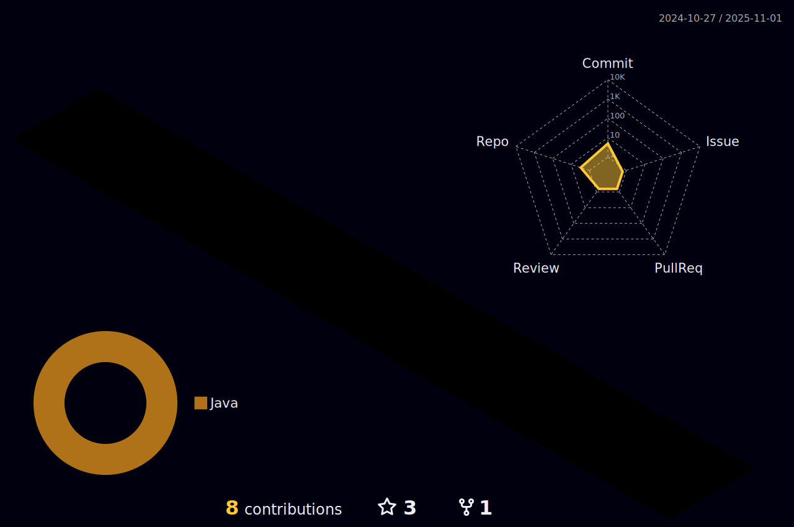

<h1 align="center"> 👋 Hi, I'm Gustavo Maisatto</h1>

 
Sou um Desenvolvedor Web full-stack e tenho muita curiosidade na área de Tecnologia, estou sempre em busca de aprimorar meus conhecimentos e ter muitas experiências. Sou organizado, persistente e sempre disposto a ajudar e a aprender algo novo. 

- :zap: Main language: 
  ######
- :bulb: Frontend:      
  ######
- 📡 Backend:   
  ######

  

  

  

 
  
  
   
  
  
  
 

<!--
**gustavomaisatto/gustavomaisatto** is a ✨ _special_ ✨ repository because its `README.md` (this file) appears on your GitHub profile.

Here are some ideas to get you started:

- 🔭 I’m currently working on ...
- 🌱 I’m currently learning ...
- 👯 I’m looking to collaborate on ...
- 🤔 I’m looking for help with ...
- 💬 Ask me about ...
- 📫 How to reach me: ...
- 😄 Pronouns: ...
- ⚡ Fun fact: ...
-->
