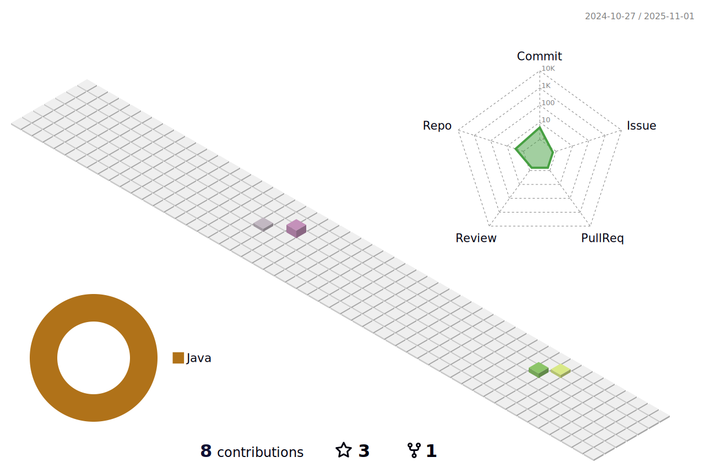

### Olá, sou o Gustavo Maisatto!!

<ul>
  <li>🔥Estagiário @rocky.monks</li>
  <li>🔥Experiência em Javascript (React, Node)</li>
  <li>🔥No momento estudando Java</li>
  </ul>

  <a href="https://github.com/gustavomaisatto">
  
  

 
  
  
  
  
  
  

  

 
  
  
   
  
  
 

<!--
**gustavomaisatto/gustavomaisatto** is a ✨ _special_ ✨ repository because its `README.md` (this file) appears on your GitHub profile.

Here are some ideas to get you started:

- 🔭 I’m currently working on ...
- 🌱 I’m currently learning ...
- 👯 I’m looking to collaborate on ...
- 🤔 I’m looking for help with ...
- 💬 Ask me about ...
- 📫 How to reach me: ...
- 😄 Pronouns: ...
- ⚡ Fun fact: ...
-->
